# Team Echo Drift - WRO Future Engineers 2025


---


**Welcome** to the official GitHub repository of **Team Echo Drift**!

This project showcases our autonomous robot for **WRO Future Engineers 2025**, built to navigate using only **camera**, **gyro**, and **encoder** data. We implement computer vision with **OpenCV**, **PID control**, and sensor data analysis in **MATLAB** to achieve precise and reliable navigation.

Explore the repository to learn more about our system design, documentation, and code!

# Table of Contents  

---

### Ⅰ. [About the Team](#about-the-team)  
### Ⅱ. [Competition Overview](#competition-overview)  
### Ⅲ. [Our Robot](#our-robot)  
### Ⅳ. [System Architecture](#system-architecture)  
### Ⅴ. [Hardware Components](#hardware-components)  
### Ⅵ. [Software & Algorithms](#software--algorithms)  
### Ⅶ. [CAD & Mechanical Design](#cad--mechanical-design)  
### Ⅷ. [Electronics & Wiring](#electronics--wiring)  
### Ⅸ. [Testing & Validation](#testing--validation)  
### Ⅹ. [Results & Performance](#results--performance)  
### Ⅺ. [Future Improvements](#future-improvements)  
### Ⅻ. [How to Run the Code](#how-to-run-the-code)  
### XIII. [Contributors](#contributors)  
### XIV. [License](#license)  

---
## About the Team  

We’re three young innovators from across Bangladesh, brought together by our love for robotics and tech. We first met as solo competitors sharing ideas, dreams, and soon a vision. That’s how our team was born.

<!-- Nurul Islam Noman -->
<table>
  <tr>
    <td>
<h2> Nurul Islam Noman - Mechanical Engineering </h2>

Specialized in Mechanical Design with experience in SolidWorks, Fusion 360, for 3D modeling. Strong background in robotics and embedded systems, 
supported by hands-on R&D work. Experience in robotics and embedded systems supports a well-rounded engineering approach, enabling the design of precise, reliable, and integrated mechanical solutions.
<br/> <br/>
_Github: [github.com/nurulislam21](https://github.com/nurulislam21/)_
    </td>
    <td>
      
    </td>
  </tr>
</table>

<!-- Tanim SK -->
<table>
  <tr>
    <td>
<h2> Tanim - Programming & Software Architecture </h2>

Skilled in Python, C++, JavaScript, OpenCV-based computer vision, Python Matplotlib and NumPy with experience in robotics, embedded systems, Raspberry Pi, microcontrollers, PlatformIO, and building user interfaces (web & tkinter).
<br/> <br/>
_Github: [github.com/tanimsk](https://github.com/tanimsk/)_
    </td>
    <td>
      
    </td>
  </tr>
</table>

<!-- Majedul Islam Naeem -->
<table>
  <tr>
    <td>
<h2> Majedul Islam Naeem - Electronics & Circuit Design </h2>

Electronics and circuit design specialist with PCB experience in EasyEDA and Altium. Skilled in etching-based PCB fabrication, soldering, prototyping, troubleshooting, and hardware testing.
<br/> <br/>
_Github: [github.com/majednaeem](https://github.com/majednaeem/)_
    </td>
    <td>
      
    </td>
  </tr>
</table>

---

## Navigation Menu
- [Project Overview](#project-overview)
- [Hardware Design & Gear System](#hardware-design--gear-system)
- [Differential Gear Mechanism](#differential-gear-mechanism)
- [Differential Gear Conversion](#differential-gear-conversion)
- [Software Architecture](#software-architecture)
- [Setup & Dependencies](#setup--dependencies)
- [Video Demonstration](#video)
- [Project Structure](#project-structure)
- [Resources & Media](#resources--media)

---

## Competition Overview  

WRO **Future Engineers** challenges teams to design autonomous electric vehicles (EVs) that can:  

- Navigate track autonomously
- Avoid obstacles and maintain a safe distance from the boundaries
- Parking out and parking out of a designated zone

---


<h2> Competition Rounds </h2>

The WRO Future Engineers 2025 competition is divided into **two progressive rounds**. Each round adds new layers of complexity and pushes teams to demonstrate engineering excellence.  


| Round | Description | Key Tasks | Track Layout |
|:------|:-----------:|:----------|:-------------|
| **Round 1 - Open Challenge** | Focuses on **precise navigation and lap consistency**. The robot must complete **3 laps** maintaing safe distance from the boundary walls. Judges emphasize **stability, accuracy, and precise lane following**. | - Focus on **stability, accuracy, and smooth lane following**  <br> - Complete **3 full laps** without error | |
| **Round 2 – Obstacle Challenge** |  The robot must avoid **color-coded obstacles** (from specific direction) and then park in a **designated zone** after **3 laps**.| - 🟩 **Green obstacle → move left**  <br> - **🟥 Red obstacle → move right**  <br> -  Maintain speed while **avoiding collisions**   <br> - Finish with **precision parking** inside a marked box  |   |


> **Both rounds are aligned with the [official WRO 2025 Future Engineers Rules (PDF)](https://wro-association.org/wp-content/uploads/WRO-2025-Future-Engineers-Self-Driving-Cars-General-Rules.pdf).**


---

## Our Robot
### Robot Overview  
**Echo Drift** brings a **next-generation autonomous EV** to WRO 2025, built for speed, accuracy, and adaptability.
  
- Precise track navigation  
- Real-time obstacle avoidance  
- Controlled drift manoeuvres

🛠️ 3D-printed chassis | 🔌 Smart sensors & drivers | 🧠 Vision & PID control

---

## 📊 Robot Specifications 

| Parameter | Value |
|-----------|-------|
| *Dimensions* | 20 cm (L) × 11 cm (W) × 18 cm (H) |
| *Weight* | ~ 0.7 kg |
| *Chassis* | Modular 3D-printed PLA with reinforced mounts |
| *Motors* | N20 motor  |
| *Motor Driver* | TB6612FNG dual-channel |
| *Steering* | MG90S Servo |
| *Sensors* | IMU, Encoder |
| *Camera* | OV5647 Fish eye 160° wide angle Camera |
| *Controller* | Raspberry Pi 5 (8GB) |
| *Battery* | 3S 11.1V Li-Po, 2200mAh |
---


## 📸 Vehicle Photos  

| Front | Right | Back |
|-------|-------|------|
|  |  |  |

| Left | Top | Bottom |
|------|-----|--------|
| 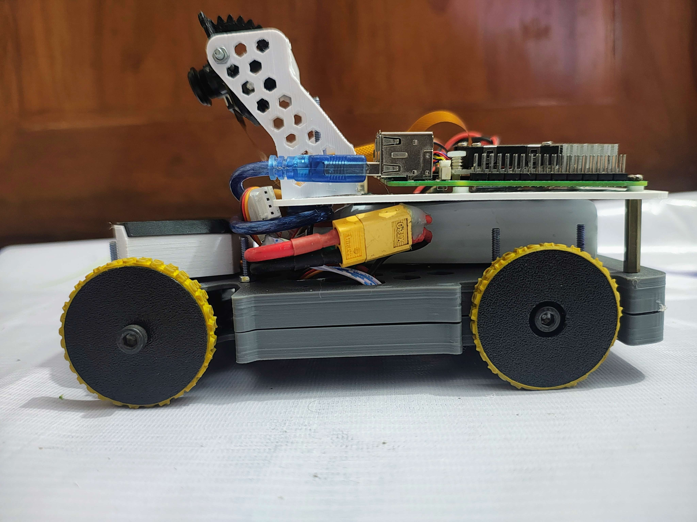 |  |  |

---

## 🎥 Videos of Our Robot  

[](https://www.youtube.com/watch?v=hIYXWFPvM-o)

[](https://www.youtube.com/watch?v=Nrufbg69Ze8)

---

## System Architecture  

  

---

## Layered Architecture Overview 

| *Layer*                | *Key Components*                                                                                                                                                    | *Role & Engineering Considerations*                                                                                                                                                                                                                                                           |
| ------------------------ | --------------------------------------------------------------------------------------------------------------------------------------------------------------------- | ----------------------------------------------------------------------------------------------------------------------------------------------------------------------------------------------------------------------------------------------------------------------------------------------- |
| *Hardware*             | - PLA + Aluminum Hybrid Chassis  <br> - 1× DC Geared Motors (12V, 600RPM, 1.2Nm)  <br> - High-Torque Servo (15kg·cm)  <br> - 65mm Rubberized Wheels                   | - Rigid but lightweight frame ensures stability and durability. <br> - Motor torque chosen with ~30% safety margin for acceleration under load. <br> - Servo provides precise steering with quick response. <br> - Wheel diameter selected for a balance between speed and traction.             |
| *Power*                | - 3S LiPo (11.1V, 2200mAh)  <br> - Power Distribution Board (12V, 5V outputs)  <br> - XT60 Connectors                                                    | - LiPo selected for high discharge rate, lightweight, and compact size. <br> - Separate regulated lines prevent voltage drop issues. <br> - XT60 provides short-circuit and overload safety.                                                                                              |
| *Perception*           | - Camera <br> - Wheel                                             | - Camera handles *lane detection and vision-based markers*. <br> - IMU improves orientation and stability on turns. <br> - Encoders provide real-time speed & distance for closed-loop control.                              |
| *Control & Processing* | - Raspberry Pi 5 (Python + OpenCV)  <br> - Arduino Nano (C++)  <br> - UART Serial Link                                                                                | - Pi processes camera input & makes high-level decisions. <br> - Arduino handles *PWM signals, interrupts, and motor control* with real-time precision. <br> - UART ensures fast, low-latency communication between subsystems.                                                               |
| *Decision*             | - OpenCV Line Detection  <br> - Sensor Fusion (Camera)  <br> - PID Steering Control  <br> - Encoder-based Speed Feedback  <br> - Emergency Stop Failsafe | - Lane tracking optimized with *real-time vision algorithms*. <br> - Sensor fusion improves obstacle avoidance accuracy. <br> - PID ensures smooth steering corrections. <br> - Encoders maintain consistent velocity. <br> - Safety protocol: robot halts when conflicting data is detected. |
| *Actuation*            | -  Motor Driver   <br> - PWM Servo Driver                                                                                                      | - H-Bridge supplies bidirectional control for drive motors. <br> - Servo driver ensures precise angle control. <br> - Final output: *smooth differential drive with adaptive steering*.                                                                                                       |
---

## Threads & Rates
| Task         |       Rate | Notes                              |
| ------------ | ---------: | ---------------------------------- |
| Sensor read  |  50–100 Hz | median filter, timeouts            |
| Vision       |  20–30 FPS | HSV masks for lane & pillar colors |
| Fusion       |      50 Hz | complementary/Kalman (optional)    |
| Navigation   |   20–50 Hz | lane-keeping, color rule, parking  |
| Control      | 100–200 Hz | PID for speed + steering           |

---


## Hardware & Mechanical Part
Our robot is designed with a balanced mix of mechanical, electrical, and electronic components, ensuring rule compliance (size, weight, drive system) and performance (precision, stability, obstacle avoidance).

### List of components

| Component | Image | Qty | Notes |
|-----------|-------|-----|-------|
| **Arduino Nano** |  | x1 | Microcontroller for low-level control |
| **Raspberry Pi 5** |  | x1 | Main controller for vision & navigation |
| **TB6612FNG Motor Driver** |  | x1 | Controls DC motors |
| **N20 DC Gear Motors (12V) with encoder** | 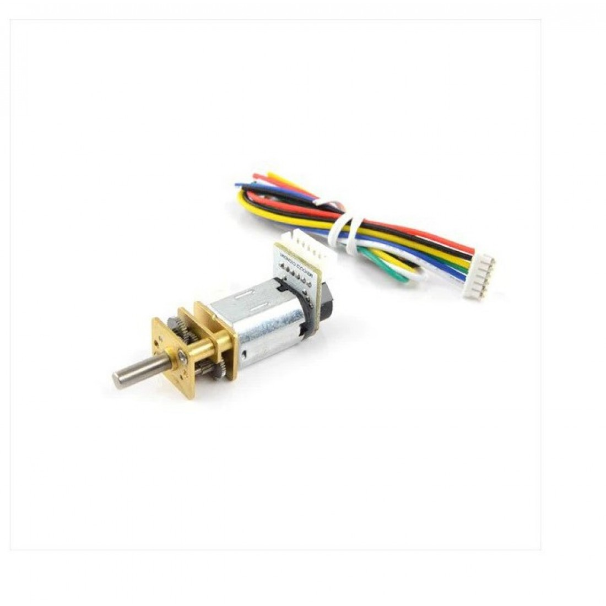 | x2 | Linked to rear axle |
| **MG90s Servo** | 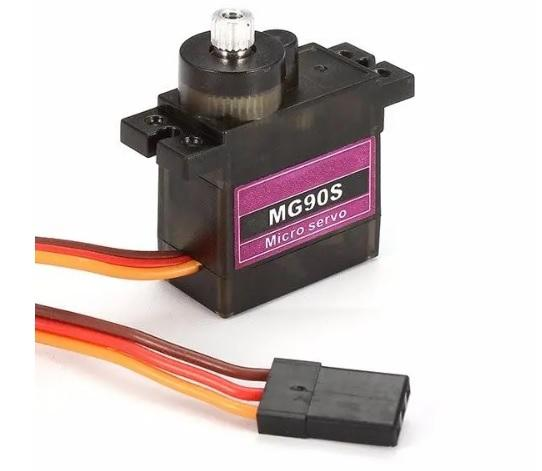 | x1 | For front wheel steering |
| **IMU MPU6050 Gyroscope** |  | x1 | Orientation & stability |
| **OV5647 Camera Module for Raspberry Pi** | 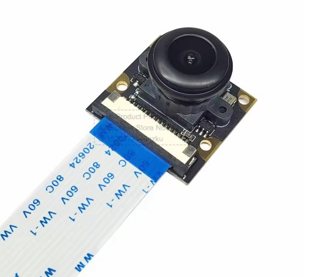 | x1 | Lane & obstacle detection |
| **Li-Po Battery (3S, 11.1V, 2200mAh)** | 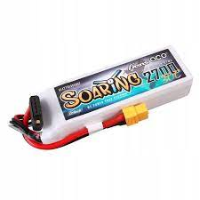 | x1 | Main power source |
| **XL4015 Step-down Converter** | 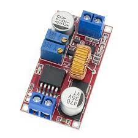 | x1 | Voltage regulation |
| **Prototype PCB Board** |  | x1 | Custom wiring layout |
| **XT60 Connector** | 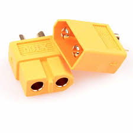 | x1 |  Main power control |
| **Buzzer** | 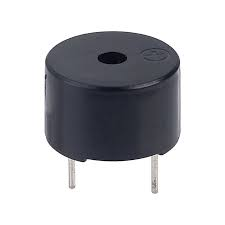 | x1 |Line Status Check |


## Mobility Management
Mobility management defines how the robot moves, steers, and maintains stability. For Echo Drift, we adopted a rear-wheel drive + front servo steering configuration. This gives better maneuverability, efficient obstacle avoidance, and realistic car-like motion.

### Motor Selection 

#### Drive Motors
- **Type:** N20 DC Geared Motors with Encoders  
- **Specs:** 12V, ~600 RPM, ~1.2 Nm torque  
- **Reason:** Higher speed compared to 300 RPM version. Encoders provide feedback for closed-loop control (speed & distance). Torque margin (~30% extra) ensures reliable acceleration.

#### Steering Servo
- **Type:** High-torque Servo (~1.8 kg·cm)  
- **Reason:** Quick, precise steering even under load.

#### Engineering Principle
Torque Required = Wheel Radius × Force (Load + Friction)

-Our calculation showed motor Required torque ≈ **0.9 Nm**  
- Selected N20 motors rated ≈ **1.2 Nm** → safe margin  
- Speed doubles from ~1.0 m/s (300 RPM) to ~2.0 m/s (600 RPM) on 45 mm wheels.

📂 Encoders connected to Arduino for speed control and stability.

| Drive Motors (N20 with Encoders) | Steering Servo Assembly |
|----------------------------------|--------------------------|
| | |


## Hardware Design & Gear System

The hardware design balances **mechanical precision** with **reliable electronics**.

**Key features:**
- **Drive System:** N20 encoder motor + TB6612FNG driver for smooth torque

- **Steering:** Parallel steering system with MG90S servo for steering control  
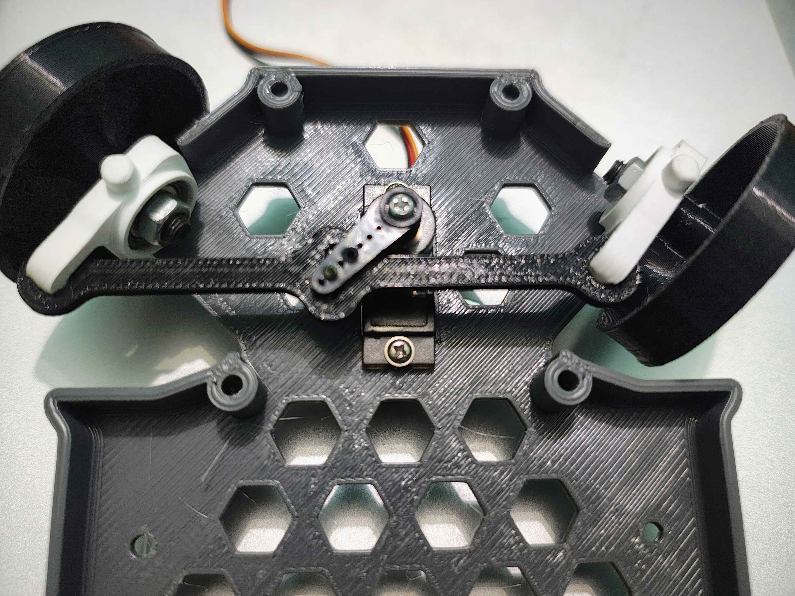

- **Differential Gear:** WL Toys differential gear with bearing
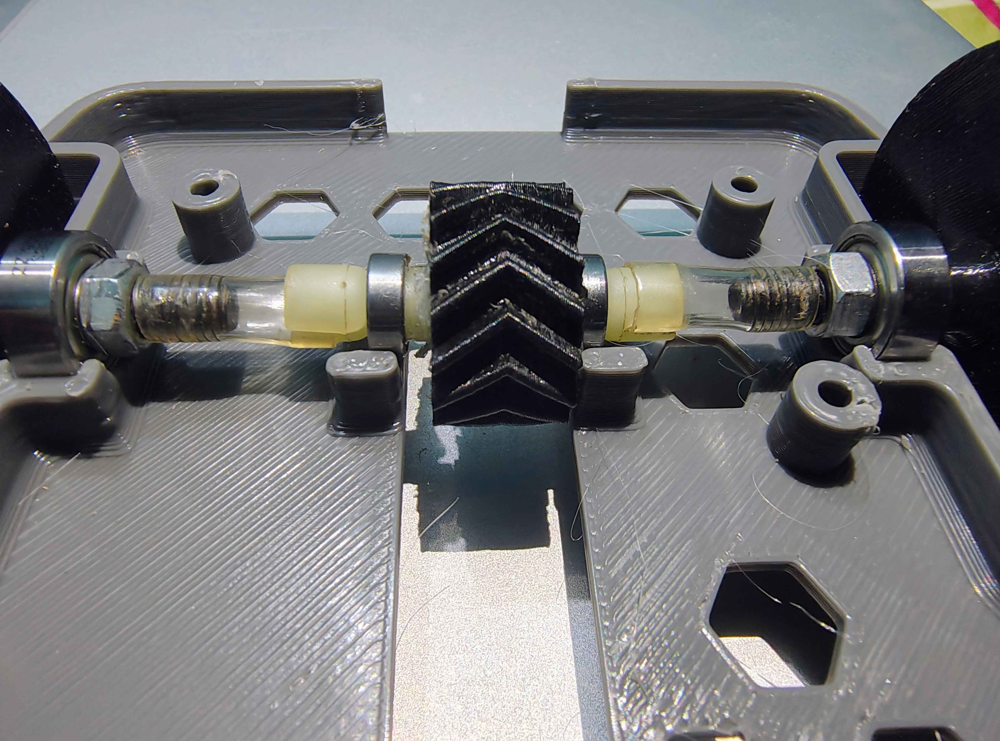
  
- **Chassis:** Fully 3D-printed (SolidWorks STL); lightweight yet strong

 


---

## Software Architecture


<p align="center">
  
</p>

---

## Setup & Dependencies

| Category | Details |
|---------|---------|
| **Operating System** | Raspberry Pi OS, Ubuntu 20.04 |
| **Programming Languages** | C, C++, Python |
| **Compiler** | GCC |
| **Libraries (C/C++)** | WiringPi, bcm2835 |
| **Build Tools** | Make, GCC toolchain |
| **Python Packages** | simple-pid, opencv-python, numpy, matplotlib, pillow, pyserial |
| **Arduino Development Platform** | PlatformIO |

**Install Dependencies:**
```bash
sudo apt update && sudo apt upgrade -y
sudo apt install build-essential git make -y

# WiringPi
git clone https://github.com/WiringPi/WiringPi
cd WiringPi && ./build && cd ..

# bcm2835
wget http://www.airspayce.com/mikem/bcm2835/bcm2835-1.71.tar.gz
tar zxvf bcm2835-1.71.tar.gz
cd bcm2835-1.71
./configure && make
sudo make check
sudo make install
cd ..

# clone our repository
git clone https://github.com/nurulislam21/WRO-FE-2025_Team-Echo-Drift/
cd WRO-FE-2025_Team-Echo-Drift/src
# install the dependencies
pip install -r requirements.txt
# run the program
python raspberrypi/main.py --debug

# for starting the program on startup, register it as a service or a crontab

```

We have divided the whole into 6 segments, each segment runs a seperate image processing thread.

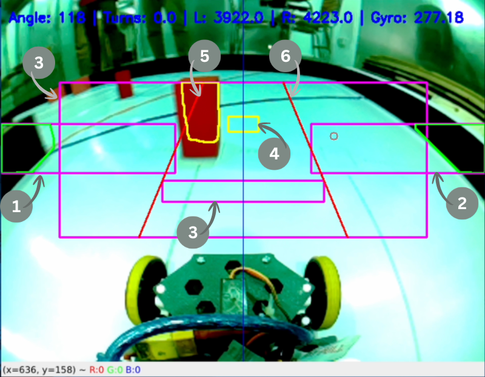

ROI Partition Explanation:
```
1. Left Wall Region: Detects the left boundary wall for lane-keeping.
2. Right Wall Region: Detects the right boundary wall for lane-keeping.
3. Reverse Region: Detects if obstacles/walls are too close.
4. Front wall Region: Detects frontal wall.
5. Left Danger Zone: Monitors for red obstacles on the right side.
6. Right Danger Zone: Monitors for green obstacles on the left side.
```


The frame regions are assigned here:


```py
# Region of Interest coordinates
LEFT_REGION = [20, 220, 270, 280]
RIGHT_REGION = [370, 220, 620, 280]
OBS_REGION = [85, 140, 555, 320]
REVERSE_REGION = [233, 300, 407, 320]
FRONT_WALL_REGION = [300, 195, 340, 215]
PARKING_LOT_REGION = [0, 185, CAM_WIDTH, 400]
DANGER_ZONE_POINTS = [
    {
        "x1": 302,
        "y1": OBS_REGION[1],
        "x2": 205,
        "y2": OBS_REGION[3],
    },
    {
        "x1": 350,
        "y1": OBS_REGION[1],
        "x2": 435,
        "y2": OBS_REGION[3],
    },
]
```

<br>


We are using LAB colors for detecting a object based on a certain color range, the color ranges are assigned as numpy arrays in [main.py](https://github.com/nurulislam21/WRO-FE-2025_Team-Echo-Drift/blob/main/src/raspberrypi/main.py):

```py
# Color ranges
LOWER_BLACK = np.array([0, 108, 90])
UPPER_BLACK = np.array([89, 148, 163])

LOWER_ORANGE = np.array([135, 125, 83])
UPPER_ORANGE = np.array([195, 165, 123])

LOWER_BLUE = np.array([93, 144, 164])
UPPER_BLUE = np.array([153, 184, 204])

# obstacle color ranges HSV
LOWER_RED = np.array([160, 100, 200])
UPPER_RED = np.array([180, 255, 255])

# HSV
LOWER_GREEN = np.array([35, 100, 50])
UPPER_GREEN = np.array([85, 255, 255])

# parking color ranges
LOWER_MAGENTA = np.array([100, 81, 105])
UPPER_MAGENTA = np.array([170, 121, 145])
```

<br>

Then we made a class called `ContourWorkers.py` in [contour_workers.py](https://github.com/nurulislam21/WRO-FE-2025_Team-Echo-Drift/blob/main/src/raspberrypi/contour_workers.py), this class is used to get contours based on the passed color ranges. ContourWorker starts 8 seperate thread for 8 regions, and processes them individually. Thus we are able to keep a decent FPS (around 25) while our bot is on the go. We are using `Queue` with size of 2 to make sure our frames are queued and passed to the thread and processed accordingly:

```py
# queues
self.frame_queue_left = Queue(maxsize=2)
self.frame_queue_right = Queue(maxsize=2)
self.frame_queue_orange = Queue(maxsize=2)
self.frame_queue_blue = Queue(maxsize=2)
self.frame_queue_green = Queue(maxsize=2)
...
```

<br>

After that, we were facing an issue for motion blur due to speed. We've resolved this issue by setting explicit `Exposure rate` and `Analogue gain` in our camera configuration:


<br>

```py
picam2.set_controls(
    {
        "ExposureTime": 16000,
        "AnalogueGain": 42.0,
        "AeEnable": False,
        "AwbEnable": False,
        "FrameDurationLimits": (40000, 40000),
    }
)
```

<br>

After the program is executed, we start 8 threads, and inside while loop, we are collecting the contour result in each iteration:

```py
# Retrieve all results from queues (non-blocking)
(
    left_result,
    right_result,
    orange_result,
    blue_result,
    green_result,
    red_result,
    reverse_result,
    front_wall_result,
    parking_result,
) = contour_workers.collect_results()
```

<br>

We are using PID steering, and for the sake of simplicity, we've used [python simple-pid](https://pypi.org/project/simple-pid/). We've made a tool [adjust_pid_values.py](https://github.com/nurulislam21/WRO-FE-2025_Team-Echo-Drift/blob/main/src/raspberrypi/adjust_pid_values.py) for adjusting the Kp, Ki, and Kd values.


<br>

We are comparing the area of left region and right region, and normalizing the error to range `[-1, 1]`.  If the left area is greater than right area the bot tends to turn right and vice versa


```py
right_area_normalized = np.interp(
    right_area,
    [0, BLACK_WALL_DETECTOR_AREA / 2, BLACK_WALL_DETECTOR_AREA],
    [0, 0.7, 1],
)
left_area_normalized = np.interp(
    left_area,
    [0, BLACK_WALL_DETECTOR_AREA / 2, BLACK_WALL_DETECTOR_AREA],
    [0, 0.7, 1],
)
error = right_area_normalized - left_area_normalized
normalized_angle_offset = pid(error)
```

<br>

For Lap detection, we are using odometry (getting xy coords from encoders and gyro)


To draw this odometry, we've collected some data of encoder ticks and gyro angle by running our bot on the track few times, and made `csv` files.
For analyzing the values, we've used [MATLAB](https://www.mathworks.com/) 


Then we've discovered that, the bot was drifting away, due to machanical error, after that we have used [Moving Average](https://en.wikipedia.org/wiki/Moving_average) realtime with the previous lap data, and hence 
calculated the drift of xy coordinates. After that, we substracted these values to omit the drift.


<br>


For obstacle avoidance, we use a pivot point as the target.
- For a red object, the pivot is the midpoint between the object’s x-coordinate and the right wall’s centroid x-coordinate.
- For a green object, the pivot is the midpoint between the object’s x-coordinate and the left wall’s centroid x-coordinate.

The pivot is calculated only when the objects enter the danger zone; otherwise, it is ignored.


```py
r_wall_x, r_wall_y = get_overall_centroid(right_result.contours)

if r_wall_x is None:
    print("No wall detected!")
    # set default wall position if none detected
    r_wall_x = CAM_WIDTH
else:
    # transform to global coordinates
    r_wall_x += RIGHT_REGION[0]

# transform to global coordinates
red_obj_x += OBS_REGION[0]
red_obj_y += OBS_REGION[1]

# compute how far is the bot from the object and walls middle point
offset_x = (red_obj_x + ((r_wall_x - red_obj_x) // 2)) - (
    CAM_WIDTH // 2
)

# show a circle dot on the middle of the object and wall
obstacle_wall_pivot = (
    red_obj_x + ((r_wall_x - red_obj_x) // 2),
    red_obj_y,
)

obj_error = offset_x / (CAM_WIDTH // 2)  # normalized [-1, 1]
```


