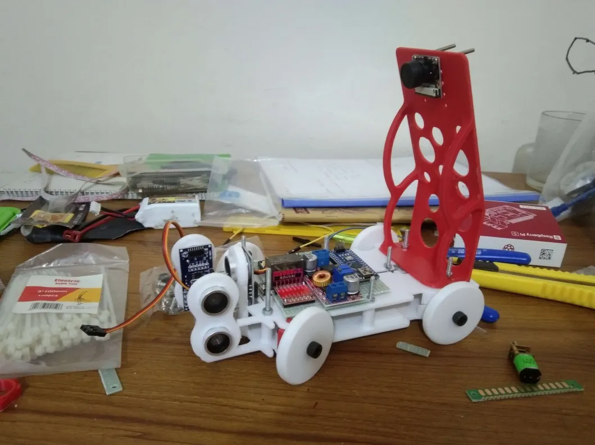
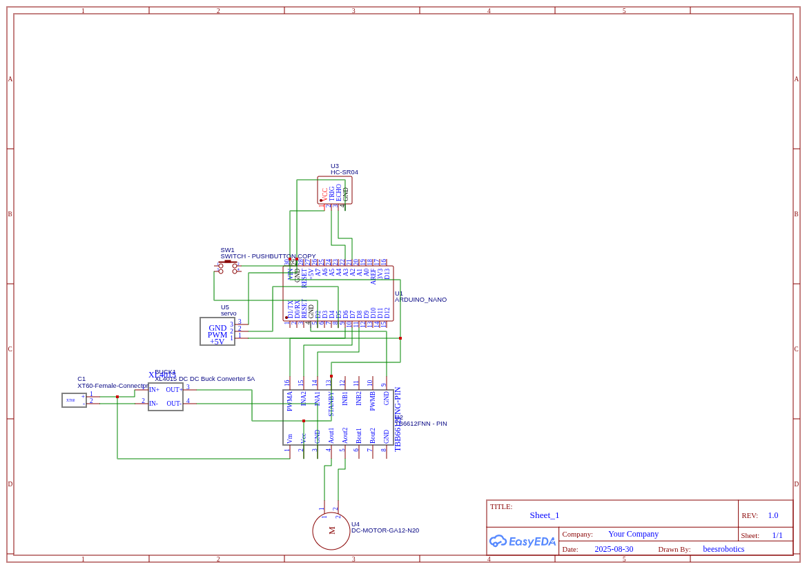
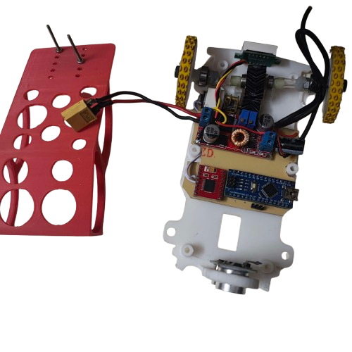

# Team Echo Drift — WRO Future Engineers 2025


---

## Navigation Menu

- [Project Overview](#project-overview)  
- [Hardware Design & Gear](#hardware-design--gear)  
- [Software Architecture](#software-architecture)  
- [Setup & Dependencies](#setup--dependencies)  
- [Build, Deployment & Usage](#build-deployment--usage)  
- [Resources & Media](#resources--media)  
- [Team & Contributors](#team--contributors)  
- [License](#license)  

---

## Project Overview

Team **Echo Drift** is our entry for **WRO Future Engineers 2025**.  
We are developing an **autonomous drift-capable vehicle** that can:

- Navigate a predefined track with precision  
- Detect and avoid obstacles dynamically  
- Perform controlled drift maneuvers  
- Ensure robustness, safety, and repeatability  

<p align="center">
  
</p>

---

## Hardware Design & Gear

Our vehicle is designed with a balance of **mechanical strength, precision gears, and reliable electronics**.

| Component | Model / Specification | Purpose / Role |
|-----------|------------------------|----------------|
| **Main Controller** | Raspberry Pi 4 Model B (Quad-core, 4 GB RAM) | High-level navigation & vision processing |
| **Motor Controller / ESC** | VESC 6-Plus | Smooth motor control, regenerative braking |
| **Drive Motors** | BLDC Motor, 12 V / 20 W | Propulsion & drift torque |
| **Steering Servo** | MG995 / similar | Ackermann steering for drift control |
| **Sensors** | Ultrasonic HC-SR04, MPU-6050 IMU, Optional LiDAR | Obstacle detection & orientation |
| **Battery** | 3S LiPo, 11.1 V 5000 mAh | Power for motors & controller |
| **Chassis** | Custom lightweight aluminum frame | Base structure |
| **Gear System** | Spur gears (15T : 45T ratio) | Provides torque boost for drifting |
| **Wheels & Tires** | Low-grip drift tires | Enables controlled sliding |
| **Other** | Wiring harness, fuses, connectors | Reliability & safety |

### Design Files & Diagrams

<p align="center">
  
</p>

<p align="center">
  
</p>

<p align="center">
  
</p>

---

## Software Architecture

- **Sensor Module** — collects and filters sensor data  
- **Control Module** — motor control, PID/ESC tuning, steering  
- **Navigation Module** — path planning & drift logic  
- **Vision Module** — optional, OpenCV/AI-based detection  
- **Main Loop** — integrates all modules into real-time operation  

<p align="center">
  
</p>

---

## Setup & Dependencies

- **OS:** Raspberry Pi OS / Ubuntu 20.04  
- **Language:** Python ≥ 3.10, C++ for embedded parts  
- **Libraries:** `numpy`, `opencv`, `RPi.GPIO`, `scipy`  
- **Tools:** GCC, Make, firmware uploader, CAD viewer  

Install dependencies:  

```bash
pip install -r requirements.txt
