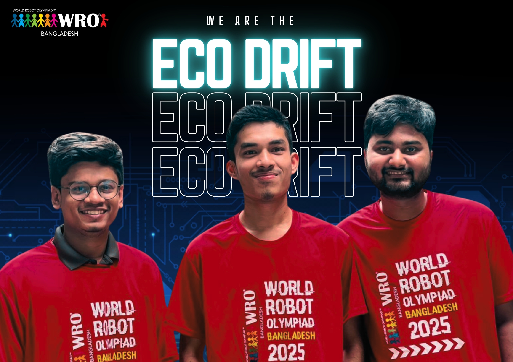
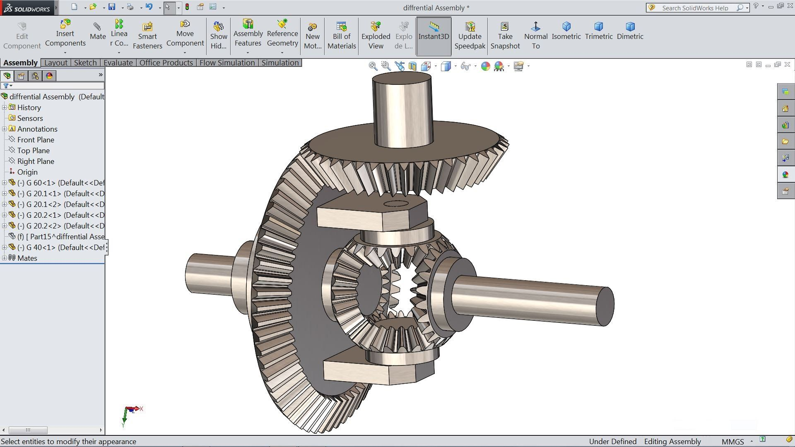
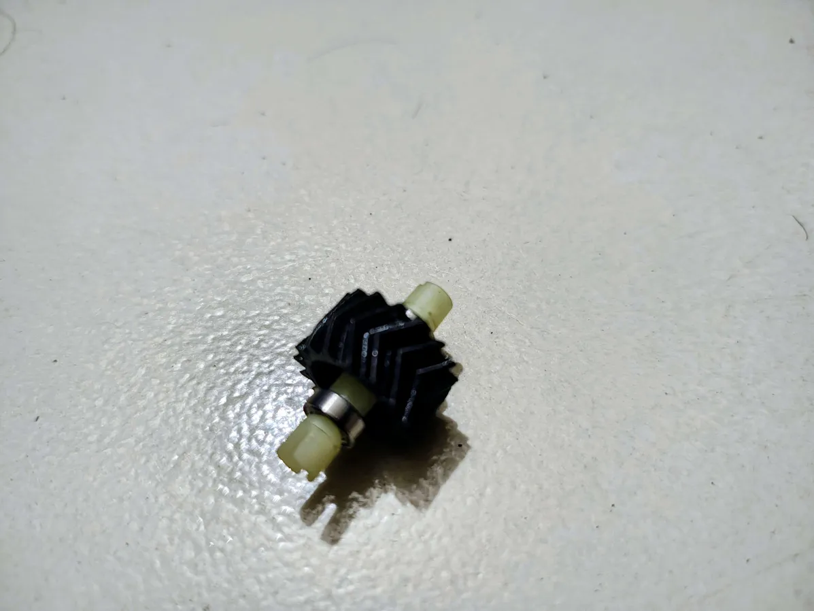

# Team Echo Drift — WRO Future Engineers 2025


---


Welcome to the official GitHub repository of **Team Echo Drift**. This repository documents the journey of **Team Echo Drift** at the **WRO Bangladesh National 2025 – Future Engineers category**.Here you’ll find the **complete documentation of our robot** — an innovation imagined, designed, and brought to life by three passionate students pushing the limits of creativity and engineering.  

# Table of Contents  

---

### Ⅰ. [About the Team](#about-the-team)  
### Ⅱ. [Competition Overview](#competition-overview)  
### Ⅲ. [Our Robot](#our-robot)  
### Ⅳ. [System Architecture](#system-architecture)  
### Ⅴ. [Hardware Components](#hardware-components)  
### Ⅵ. [Software & Algorithms](#software--algorithms)  
### Ⅶ. [CAD & Mechanical Design](#cad--mechanical-design)  
### Ⅷ. [Electronics & Wiring](#electronics--wiring)  
### Ⅸ. [Testing & Validation](#testing--validation)  
### Ⅹ. [Results & Performance](#results--performance)  
### Ⅺ. [Future Improvements](#future-improvements)  
### Ⅻ. [How to Run the Code](#how-to-run-the-code)  
### XIII. [Contributors](#contributors)  
### XIV. [License](#license)  

---
## About the Team  

We are a team of three young innovators, coming from different corners of Bangladesh. At first, each of us participated individually in many competitions across the country. Through those journeys, we eventually met one another, shared our dreams, and realised that together we could achieve something even greater. That was the beginning of our team.

From the very start, we have built a strong bond based on trust, hard work, and a shared passion for robotics. Step by step, we worked side by side and successfully won several national robotics competitions, which made us more confident about our vision.

A few months ago, we set ourselves a bigger goal—to represent Bangladesh in the World Robot Olympiad. Since then, we have been working with full dedication and determination. Our dream is simple but powerful: to raise the flag of Bangladesh high on the international stage and prove that with passion, teamwork, and belief, anything is possible.
 
<p align="center">
  
</p>

---

## Meet the Team  
<!-- Meet the Team Section -->
<div style="background:#5ec6c6; padding:50px; border-radius:10px;">

  <h2 align="center" style="color:#2a3c3c; font-size:32px; margin-bottom:10px;">
    Our Teams
  </h2>
  <p align="center" style="color:#333; font-size:14px; margin-bottom:40px;">
    Robotics, Electronics & Mechanical Experts Working Together 🚀
  </p>

  <div align="center" style="display:flex; justify-content:center; gap:40px; flex-wrap:wrap;">

   <!-- Member 1 -->
   <div style="text-align:center; width:220px;">
     <svg width="200" height="200" xmlns="http://www.w3.org/2000/svg">
       <path d="M60,-70C80,-50,100,-30,100,0C100,30,80,60,50,80C20,100,-20,100,-50,80C-80,60,-100,30,-100,0C-100,-30,-80,-60,-50,-70C-20,-80,20,-90,60,-70Z" fill="#2449d8" transform="translate(100 100)"/>
       <clipPath id="img1">
         <circle cx="100" cy="100" r="70"/>
       </clipPath>
       <image href="https://github.com/nurulislam21/WRO-FE-2025_Team-Echo-Drift/blob/main/t-photos/Noman.jpg?raw=true" width="200" height="200" clip-path="url(#img1)"/>
     </svg>
     <h3 style="margin:10px 0 5px; color:#fff;">Nurul Islam Noman</h3>
     <p style="margin:0; color:#fff; font-size:14px;">Mechanical Design</p>
   </div>

   <!-- Member 2 -->
   <div style="text-align:center; width:220px;">
     <svg width="200" height="200" xmlns="http://www.w3.org/2000/svg">
       <path d="M60,-70C90,-60,110,-20,100,20C90,60,50,90,10,100C-30,110,-70,100,-90,70C-110,40,-120,0,-100,-30C-80,-60,-40,-80,0,-90C40,-100,80,-90,60,-70Z" fill="#f2b844" transform="translate(100 100)"/>
       <clipPath id="img2">
         <circle cx="100" cy="100" r="70"/>
       </clipPath>
       <image href="https://github.com/nurulislam21/WRO-FE-2025_Team-Echo-Drift/blob/main/t-photos/tanim.jpg?raw=true" width="200" height="200" clip-path="url(#img2)"/>
     </svg>
     <h3 style="margin:10px 0 5px; color:#fff;">Tanim SK</h3>
     <p style="margin:0; color:#fff; font-size:14px;">Programming & Software Architecture</p>
   </div>

   <!-- Member 3 -->
   <div style="text-align:center; width:220px;">
     <svg width="200" height="200" xmlns="http://www.w3.org/2000/svg">
       <path d="M70,-80C100,-60,120,-20,110,20C100,60,60,90,20,110C-20,120,-60,110,-80,80C-100,50,-120,10,-110,-30C-100,-70,-60,-100,-20,-110C20,-120,60,-100,70,-80Z" fill="#f28585" transform="translate(100 100)"/>
       <clipPath id="img3">
         <circle cx="100" cy="100" r="70"/>
       </clipPath>
       <image href="t-photos/Naeem.jpg" width="200" height="200" clip-path="url(#img3)"/>
     </svg>
     <h3 style="margin:10px 0 5px; color:#fff;">Majedul Islam Naeem</h3>
     <p style="margin:0; color:#fff; font-size:14px;">Electronics & Circuit Design</p>
   </div>

  </div>
</div>

---

## Navigation Menu
- [Project Overview](#project-overview)
- [Hardware Design & Gear System](#hardware-design--gear-system)
- [Differential Gear Mechanism](#differential-gear-mechanism)
- [Differential Gear Conversion](#differential-gear-conversion)
- [Software Architecture](#software-architecture)
- [Setup & Dependencies](#setup--dependencies)
- [Video Demonstration](#video)
- [Project Structure](#project-structure)
- [Resources & Media](#resources--media)

---

## Competition Overview  

WRO **Future Engineers** challenges teams to design autonomous electric vehicles (EVs) that can:  

- Navigate complex tracks  
- Handle lane following, obstacle avoidance, parking, and overtaking  
- Optimize performance for efficiency and reliability  

>  **For 2025, the challenge emphasizes real-world autonomous driving concepts aligned with SDG 11 — Sustainable Cities and Communities.**


---

##  Competition Rounds 

The WRO Future Engineers 2025 competition is divided into **two progressive rounds**. Each round adds new layers of complexity and pushes teams to demonstrate engineering excellence.  


| Round | Description | Key Tasks | Track Layout |
|:------|:-----------:|:----------|:-------------|
| **Round 1 – Endurance Lap** | Focuses on **reliability and lap consistency**. The robot must complete **3 laps** without error while maintaining smooth navigation. Judges emphasize **stability, accuracy, and precise lane following**. | - 🎯 Focus on **stability, accuracy, and smooth lane following**  <br> - 🏁 Complete **3 full laps** without error  <br> ⏱️ Time-based scoring adds pressure   | |
| **Round 2 – Smart Navigation + Parking** | Introduces **real-time intelligence**. After completing laps, the robot must avoid **color-coded obstacles** and then park in a **designated zone**.| - 🟩 **Green obstacle → move left**  <br> - 🟥 **Red obstacle → move right**  <br> - 🏎️ Maintain speed while **avoiding collisions**   <br> -- 🅿️ Finish with **precision parking** inside a marked box  |   |


> **Both rounds are aligned with the [official WRO 2025 Future Engineers Rules (PDF)](https://wro-association.org/wp-content/uploads/WRO-2025-Future-Engineers-Self-Driving-Cars-General-Rules.pdf).**


---


##  Our Robot  

### 🔎 Robot Overview  
**Echo Drift** brings a **next-generation autonomous EV** to WRO 2025, built for speed, accuracy, and adaptability.
  
- 🚗 Precise track navigation  
- ⚡ Real-time obstacle avoidance  
- 🎯 Controlled drift maneuvers  
- 🔒 Safe & reliable performance  

🛠️ 3D-printed chassis | 🔌 Smart sensors & drivers | 🧠 Vision & PID control

---

## 📊 Robot Specifications  

| Parameter | Value |
|-----------|-------|
| **Dimensions** | 280 mm (L) × 190 mm (W) × 160 mm (H) |
| **Weight** | ~ 1.4 kg |
| **Chassis** | Modular 3D-printed PLA with reinforced mounts |
| **Motors** | N20  |
| **Motor Driver** | TB6612FNG dual-channel |
| **Steering** | MG995 Servo |
| **Sensors** | HC-SR04 Ultrasonic × 2, IMU, Optional Camera |
| **Controller** | Raspberry Pi 5 (8GB) |
| **Battery** | 3S 11.1V Li-Po, 2200mAh |
| **Special Feature** | Custom herringbone gear differential for drift |
---

## 📸 Vehicle Photos  

| Front | Right | Back |
|-------|-------|------|
|  |  |  |

| Left | Top | Bottom |
|------|-----|--------|
|  |  |  |

---

## 🎥 Videos of Our Robot  

[](https://youtu.be/XXXXXXXX)  
[](https://youtu.be/YYYYYYYY)  
[](https://youtu.be/ZZZZZZZZ)  
 

👉 *(Videos will be linked here once uploaded to YouTube)*  

---


<p align="center">
  
</p>

---

## Hardware Design & Gear System

The hardware design balances **mechanical precision** with **reliable electronics**.

**Key features:**
- **Chassis:** Fully 3D-printed (SolidWorks STL); lightweight yet strong  
- **Drive System:** N20/BLDC motors + TB6612FNG driver for smooth torque/drift  
- **Differential Gear:** Custom 3D-printed with **herringbone outer gear**  
- **Steering:** Ackermann system with MG995 servo for precise control  

<p align="left">   </p>

| Component                    | Model / Specification                                          | Purpose |
| ---------------------------- | -------------------------------------------------------------- | ------- |
| **Main Controller**          | Raspberry Pi 5 (8 GB)                                          | High-level navigation & vision |
| **Motor Controller**         | TB6612FNG                                                      | Motor control & braking |
| **Drive Motors**             | N20 Motor, 12 V                                                | Propulsion & torque |
| **Steering Servo**           | MG995                                                          | Steering control |
| **Differential Gear System** | 3D-printed + **herringbone outer gear**                        | Torque distribution |
| **Sensors**                  | Ultrasonic HC-SR04                                             | Obstacle detection |
| **Battery**                  | 3S LiPo, 11.1 V 2200 mAh                                       | Power |
| **Chassis**                  | 3D-printed STL (SolidWorks)                                    | Lightweight & modular |
| **Gear System**              | Spur gears (15T : 45T)                                         | Torque amplification |
| **Wheels & Tires**           | Low-grip drift tires                                           | Controlled sliding |
| **Other**                    | Wiring, fuses, connectors                                      | Reliability |

---

## Differential Gear Mechanism

The **differential gear** is the core of our vehicle’s drift performance:
- **Herringbone Outer Gear:** Reduces axial thrust, improves torque distribution  
- **3D-Printed Precision:** Designed in SolidWorks, printed with high-resolution filament  
- **Smooth Drift Control:** Balances wheel speed during cornering  
- **Customizable:** Adjustable gear ratios for drift tuning  

<p align="center">
  
</p>

> **Key Advantage:** Efficient power transmission with minimal slippage during drift maneuvers.

### Why a Differential Gear?
- Improves stability in high-speed drift  
- Reduces tire wear & drivetrain stress  
- Ensures smooth handling for navigation  

[](https://www.youtube.com/watch?v=F40ZBDAG8-o)

---

## Differential Gear Conversion

We began with a ready-made RC differential:  

**Model:** Differential with Bearing 284010-2252  
**Application:** WLtoys 284010 / 284161 / K989 / 284131 (1/28 RC Car)  

The stock gear lacked torque efficiency for drifting.  
✅ Solution: Converted it by designing a **3D-printed herringbone outer gear** in SolidWorks.  

<p align="center">
  
  
</p>

<p align="center"><em>Left: Ready-made RC Differential → Right: Converted with 3D-Printed Herringbone Outer Gear</em></p>

---

## Software Architecture

Our software is modular, optimized for **real-time autonomous control**.

- **Sensor Module:** Collects & processes sensor data  
- **Control Module:** PID motor & steering control  
- **Navigation Module:** Path planning, drift logic, obstacle avoidance  
- **Vision Module:** (optional) AI with OpenCV  
- **Main Loop:** Integrates all modules in real time  

<p align="center">
  
</p>

---

## Setup & Dependencies

**Environment:**
- OS: Raspberry Pi OS / Ubuntu 20.04  
- Languages: C, C++, Python  
- Compiler: GCC  
- Libraries: WiringPi, bcm2835  
- Tools: Make, GCC toolchain  

**Install Dependencies:**
```bash
sudo apt update && sudo apt upgrade -y
sudo apt install build-essential git make -y

# WiringPi
git clone https://github.com/WiringPi/WiringPi
cd WiringPi && ./build && cd ..

# bcm2835
wget http://www.airspayce.com/mikem/bcm2835/bcm2835-1.71.tar.gz
tar zxvf bcm2835-1.71.tar.gz
cd bcm2835-1.71
./configure && make
sudo make check
sudo make install
cd ..
