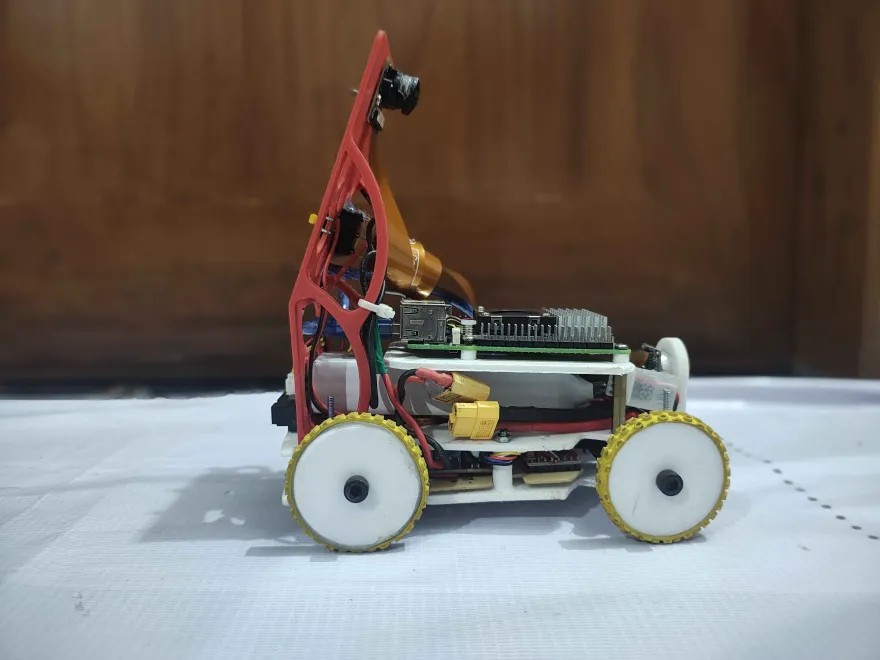
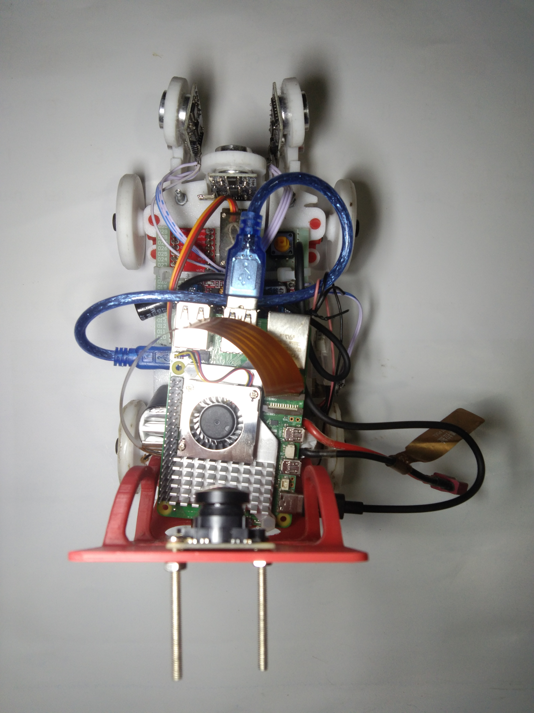

# Team Echo Drift — WRO Future Engineers 2025


---


Welcome to the official GitHub repository of **Team Echo Drift**. This repository documents the journey of **Team Echo Drift** at the **WRO Bangladesh National 2025 – Future Engineers category**.Here you’ll find the **complete documentation of our robot** — an innovation imagined, designed, and brought to life by three passionate students pushing the limits of creativity and engineering.  

# Table of Contents  

---

### Ⅰ. [About the Team](#about-the-team)  
### Ⅱ. [Competition Overview](#competition-overview)  
### Ⅲ. [Our Robot](#our-robot)  
### Ⅳ. [System Architecture](#system-architecture)  
### Ⅴ. [Hardware Components](#hardware-components)  
### Ⅵ. [Software & Algorithms](#software--algorithms)  
### Ⅶ. [CAD & Mechanical Design](#cad--mechanical-design)  
### Ⅷ. [Electronics & Wiring](#electronics--wiring)  
### Ⅸ. [Testing & Validation](#testing--validation)  
### Ⅹ. [Results & Performance](#results--performance)  
### Ⅺ. [Future Improvements](#future-improvements)  
### Ⅻ. [How to Run the Code](#how-to-run-the-code)  
### XIII. [Contributors](#contributors)  
### XIV. [License](#license)  

---
## About the Team  

We are a team of three young innovators, coming from different corners of Bangladesh. At first, each of us participated individually in many competitions across the country. Through those journeys, we eventually met one another, shared our dreams, and realised that together we could achieve something even greater. That was the beginning of our team.

From the very start, we have built a strong bond based on trust, hard work, and a shared passion for robotics. Step by step, we worked side by side and successfully won several national robotics competitions, which made us more confident about our vision.

A few months ago, we set ourselves a bigger goal—to represent Bangladesh in the World Robot Olympiad. Since then, we have been working with full dedication and determination. Our dream is simple but powerful: to raise the flag of Bangladesh high on the international stage and prove that with passion, teamwork, and belief, anything is possible.
 
<p align="center">
  
</p>

---

## Meet the Team  

### *Nurul Islam Noman – Mechanical Design*

Specializing in Mechanical Design with strong experience in Robotics and Embedded Systems. Extensive work in research and development has built expertise where precision, innovation, and reliability are key.

Skills span Robotics, Embedded Systems, and Mechanical Design, enabling a holistic approach to complex technical challenges. With a focus on Mechanical Design, the goal is to create solutions that seamlessly integrate hardware, software, and system reliability.
<p align="center">
  
</p>

### *Tanim SK – Programming & Software Architecture* 

A versatile programmer with expertise in Python, JavaScript, HTML, CSS, and C++, and over 5 years of experience in software development. Skilled in building web applications using frameworks like Django, Flask, and FastAPI for the backend, and ReactJS for the frontend, with PostgreSQL for databases and Redis for caching. Experienced in deploying web applications on AWS and similar platforms with CI/CD integration.

Also proficient in working with Raspberry Pi and microcontrollers, with experience in home automation, WebSocket programming, RF communication, and integrating TinyML for lightweight AI projects.
<p align="center">
  
</p>


### *Majedul Islam Naeem – Electronics & Circuit Design* 

Majedul Islam Naeem is a passionate Robotics and Embedded Systems innovator with strong expertise in Electronics & Circuit Design. He excels at transforming ideas into practical, intelligent solutions, designing efficient circuits, and integrating electronics seamlessly with robotics projects. 

Driven by curiosity and creativity, Naeem thrives in collaborative environments and is committed to pushing the boundaries of technology while inspiring others to innovate.
<p align="center">
  
</p>
---

## Navigation Menu
- [Project Overview](#project-overview)
- [Hardware Design & Gear System](#hardware-design--gear-system)
- [Differential Gear Mechanism](#differential-gear-mechanism)
- [Differential Gear Conversion](#differential-gear-conversion)
- [Software Architecture](#software-architecture)
- [Setup & Dependencies](#setup--dependencies)
- [Video Demonstration](#video)
- [Project Structure](#project-structure)
- [Resources & Media](#resources--media)

---

## Competition Overview  

WRO **Future Engineers** challenges teams to design autonomous electric vehicles (EVs) that can:  

- Navigate complex tracks  
- Handle lane following, obstacle avoidance, parking, and overtaking  
- Optimize performance for efficiency and reliability  

>  **For 2025, the challenge emphasizes real-world autonomous driving concepts aligned with SDG 11 — Sustainable Cities and Communities.**


---

##  Competition Rounds 

The WRO Future Engineers 2025 competition is divided into **two progressive rounds**. Each round adds new layers of complexity and pushes teams to demonstrate engineering excellence.  


| Round | Description | Key Tasks | Track Layout |
|:------|:-----------:|:----------|:-------------|
| **Round 1 – Endurance Lap** | Focuses on **reliability and lap consistency**. The robot must complete **3 laps** without error while maintaining smooth navigation. Judges emphasize **stability, accuracy, and precise lane following**. | - 🯠Focus on **stability, accuracy, and smooth lane following**  <br> - ğŸ Complete **3 full laps** without error  <br> â±ï¸ Time-based scoring adds pressure   | |
| **Round 2 – Smart Navigation + Parking** | Introduces **real-time intelligence**. After completing laps, the robot must avoid **color-coded obstacles** and then park in a **designated zone**.| - 🟩 **Green obstacle → move left**  <br> - 🟥 **Red obstacle → move right**  <br> - 🏎️ Maintain speed while **avoiding collisions**   <br> -- 🅿️ Finish with **precision parking** inside a marked box  |   |


> **Both rounds are aligned with the [official WRO 2025 Future Engineers Rules (PDF)](https://wro-association.org/wp-content/uploads/WRO-2025-Future-Engineers-Self-Driving-Cars-General-Rules.pdf).**


---

## Our Robot
### Robot Overview  
**Echo Drift** brings a **next-generation autonomous EV** to WRO 2025, built for speed, accuracy, and adaptability.
  
- 🚗 Precise track navigation  
- ⚡ Real-time obstacle avoidance  
- 🎯 Controlled drift maneuvers  
- 🔒 Safe & reliable performance  

🛠️ 3D-printed chassis | 🔌 Smart sensors & drivers | 🧠 Vision & PID control

---

## 📊 Robot Specifications  

| Parameter | Value |
|-----------|-------|
| **Dimensions** | 280 mm (L) × 190 mm (W) × 160 mm (H) |
| **Weight** | ~ 1.4 kg |
| **Chassis** | Modular 3D-printed PLA with reinforced mounts |
| **Motors** | N20  |
| **Motor Driver** | TB6612FNG dual-channel |
| **Steering** | MG995 Servo |
| **Sensors** | HC-SR04 Ultrasonic × 2, IMU, Optional Camera |
| **Controller** | Raspberry Pi 5 (8GB) |
| **Battery** | 3S 11.1V Li-Po, 2200mAh |
| **Special Feature** | Custom herringbone gear differential for drift |
---

## 📸 Vehicle Photos  

| Front | Right | Back |
|-------|-------|------|
|  |  |  |

| Left | Top | Bottom |
|------|-----|--------|
|  |  |  |

---

## 🎥 Videos of Our Robot  

[](https://www.youtube.com/watch?v=efOUVDhcxk8)  
[](https://www.youtube.com/watch?v=GM8HPATsVBk)  
[](https://youtu.be/ZZZZZZZZ)  
 

👉 *(Videos will be linked here once uploaded to YouTube)*  

---

## System Architecture  

The **Echo Drift Autonomous EV** is designed with a **layered and modular architecture** to ensure clarity, testability, and compliance with WRO 2025 Future Engineers standards.  

## System Flow Diagram

  
---
## Layered Architecture Overview 

| **Layer**                | **Key Components**                                                                                                                                                    | **Role & Engineering Considerations**                                                                                                                                                                                                                                                           |
| ------------------------ | --------------------------------------------------------------------------------------------------------------------------------------------------------------------- | ----------------------------------------------------------------------------------------------------------------------------------------------------------------------------------------------------------------------------------------------------------------------------------------------- |
| **Hardware**             | - PLA + Aluminum Hybrid Chassis  <br> - 2× DC Geared Motors (12V, 300RPM, 1.2Nm)  <br> - High-Torque Servo (15kg·cm)  <br> - 65mm Rubberized Wheels                   | - Rigid but lightweight frame ensures stability and durability. <br> - Motor torque chosen with ~30% safety margin for acceleration under load. <br> - Servo provides precise steering with quick response. <br> - Wheel diameter selected for balance between speed and traction.             |
| **Power**                | - 3S LiPo (11.1V, 2200mAh)  <br> - Power Distribution Board (12V, 5V, 3.3V outputs)  <br> - Fuse + XT60 Connectors                                                    | - LiPo selected for high discharge rate, lightweight, and compact size. <br> - Separate regulated lines prevent voltage drop issues. <br> - Fuse + XT60 provide short-circuit and overload safety.                                                                                              |
| **Perception**           | - Camera (USB/PiCam)  <br> - 2× Ultrasonic Sensors (front-left & front-right)  <br> - IMU (MPU6050)  <br> - Wheel Encoders                                            | - Camera handles **lane detection and vision-based markers**. <br> - Ultrasonic ensures reliable short-range obstacle sensing. <br> - IMU improves orientation and stability on turns. <br> - Encoders provide real-time speed & distance for closed-loop control.                              |
| **Control & Processing** | - Raspberry Pi 4 (Python + OpenCV)  <br> - Arduino Mega (C++)  <br> - UART Serial Link                                                                                | - Pi processes camera input & makes high-level decisions. <br> - Arduino handles **PWM signals, interrupts, and motor control** with real-time precision. <br> - UART ensures fast, low-latency communication between subsystems.                                                               |
| **Decision**             | - OpenCV Line Detection  <br> - Sensor Fusion (Camera + Ultrasonic)  <br> - PID Steering Control  <br> - Encoder-based Speed Feedback  <br> - Emergency Stop Failsafe | - Lane tracking optimized with **real-time vision algorithms**. <br> - Sensor fusion improves obstacle avoidance accuracy. <br> - PID ensures smooth steering corrections. <br> - Encoders maintain consistent velocity. <br> - Safety protocol: robot halts when conflicting data is detected. |
| **Actuation**            | - H-Bridge Motor Driver (e.g., BTS7960)  <br> - PWM Servo Driver                                                                                                      | - H-Bridge supplies bidirectional control for drive motors. <br> - Servo driver ensures precise angle control. <br> - Final output: **smooth differential drive with adaptive steering**.                                                                                                       |
---
## Threads & Rates
| Task         |       Rate | Notes                              |
| ------------ | ---------: | ---------------------------------- |
| Sensor read  |  50–100 Hz | median filter, timeouts            |
| Vision       |  20–30 FPS | HSV masks for lane & pillar colors |
| Fusion       |      50 Hz | complementary/Kalman (optional)    |
| Navigation   |   20–50 Hz | lane-keeping, color rule, parking  |
| Control      | 100–200 Hz | PID for speed + steering           |
| Actuator I/O | 100–200 Hz | PWM/UART                           |
| Logger       |      10 Hz | CSV + HUD overlay                  |
| Watchdog     |       5 Hz | trips SAFE\_STOP                   |

---


## Hardware & Mechanical Part
Our robot is designed with a balanced mix of mechanical, electrical, and electronic components, ensuring rule compliance (size, weight, drive system) and performance (precision, stability, obstacle avoidance).

### List of components

| Component | Image | Qty | Notes |
|-----------|-------|-----|-------|
| **Arduino Nano A000005** |  | x1 | Microcontroller for low-level control |
| **Raspberry Pi 5** |  | x1 | Main controller for vision & navigation |
| **TB6612FNG Motor Driver** |  | x1 | Controls 2 DC motors |
| **L298N Motor Driver (Backup)** |  | x1 | Legacy driver for testing |
| **DC Gear Motors (12V)** |  | x2 | Linked to rear axle |
| **MG995 Servo** |  | x1 | Ackermann steering |
| **HC-SR04 Ultrasonic Sensor** |  | x3 | Obstacle detection (front + side) |
| **IMU MPU6050 Gyroscope** |  | x1 | Orientation & stability |
| **Camera Module (CSI/USB)** |  | x1 | Lane & obstacle detection |
| **Neo-6M GPS Module** |  | x1 | Outdoor navigation (optional) |
| **Li-Po Battery (3S, 11.1V, 2200mAh)** |  | x1 | Main power source |
| **LM2596 Step-down Converter** |  | x2 | Voltage regulation (5V & 3.3V) |
| **Prototype PCB Board** |  | x2 | Custom wiring layout |
| **Breadboard (Mini)** |  | x1 | Quick prototyping |
| **Wheels with Rubber Tires** |  | x4 | High grip on track |
| **3D Printed Chassis Parts** |  | - | Lightweight & modular |
| **Power Switch** |  | x1 | Main power control |
| **Start Button** |  | x1 | Competition start |
| **Emergency Stop (E-Stop) Switch** |  | x1 | Safety cutoff |
| **Jumper Wires (Male-Female)** |  | 40+ | Connections |
| **Heat Shrink Tubes** |  | Pack | Wire insulation |
| **Screws & Standoffs** |  | - | Mounting hardware |
| **Cooling Fan (5V)** |  | x1 | Keeps Pi cool |
| **USB Power Bank (Backup)** |  | x1 | Debugging power |
| **LED Indicators (Red/Green)** |  | x2 | Status display |


### Mobility 

## Hardware Design & Gear System

The hardware design balances **mechanical precision** with **reliable electronics**.

**Key features:**
- **Chassis:** Fully 3D-printed (SolidWorks STL); lightweight yet strong  
- **Drive System:** N20/BLDC motors + TB6612FNG driver for smooth torque/drift  
- **Differential Gear:** Custom 3D-printed with **herringbone outer gear**  
- **Steering:** Ackermann system with MG995 servo for precise control  

<p align="left">   </p>

| Component                    | Model / Specification                                          | Purpose |
| ---------------------------- | -------------------------------------------------------------- | ------- |
| **Main Controller**          | Raspberry Pi 5 (8 GB)                                          | High-level navigation & vision |
| **Motor Controller**         | TB6612FNG                                                      | Motor control & braking |
| **Drive Motors**             | N20 Motor, 12 V                                                | Propulsion & torque |
| **Steering Servo**           | MG995                                                          | Steering control |
| **Differential Gear System** | 3D-printed + **herringbone outer gear**                        | Torque distribution |
| **Sensors**                  | Ultrasonic HC-SR04                                             | Obstacle detection |
| **Battery**                  | 3S LiPo, 11.1 V 2200 mAh                                       | Power |
| **Chassis**                  | 3D-printed STL (SolidWorks)                                    | Lightweight & modular |
| **Gear System**              | Spur gears (15T : 45T)                                         | Torque amplification |
| **Wheels & Tires**           | Low-grip drift tires                                           | Controlled sliding |
| **Other**                    | Wiring, fuses, connectors                                      | Reliability |

---

## Differential Gear Mechanism

The **differential gear** is the core of our vehicle’s drift performance:
- **Herringbone Outer Gear:** Reduces axial thrust, improves torque distribution  
- **3D-Printed Precision:** Designed in SolidWorks, printed with high-resolution filament  
- **Smooth Drift Control:** Balances wheel speed during cornering  
- **Customizable:** Adjustable gear ratios for drift tuning  

<p align="center">
  
</p>

> **Key Advantage:** Efficient power transmission with minimal slippage during drift maneuvers.

### Why a Differential Gear?
- Improves stability in high-speed drift  
- Reduces tire wear & drivetrain stress  
- Ensures smooth handling for navigation  

[](https://www.youtube.com/watch?v=F40ZBDAG8-o)

---

## Differential Gear Conversion

We began with a ready-made RC differential:  

**Model:** Differential with Bearing 284010-2252  
**Application:** WLtoys 284010 / 284161 / K989 / 284131 (1/28 RC Car)  

The stock gear lacked torque efficiency for drifting.  
✅ Solution: Converted it by designing a **3D-printed herringbone outer gear** in SolidWorks.  

<p align="center">
  
  
</p>

<p align="center"><em>Left: Ready-made RC Differential → Right: Converted with 3D-Printed Herringbone Outer Gear</em></p>

---

## Software Architecture

Our software is modular, optimized for **real-time autonomous control**.

- **Sensor Module:** Collects & processes sensor data  
- **Control Module:** PID motor & steering control  
- **Navigation Module:** Path planning, drift logic, obstacle avoidance  
- **Vision Module:** (optional) AI with OpenCV  
- **Main Loop:** Integrates all modules in real time  

<p align="center">
  
</p>

---

## Setup & Dependencies

**Environment:**
- OS: Raspberry Pi OS / Ubuntu 20.04  
- Languages: C, C++, Python  
- Compiler: GCC  
- Libraries: WiringPi, bcm2835  
- Tools: Make, GCC toolchain  

**Install Dependencies:**
```bash
sudo apt update && sudo apt upgrade -y
sudo apt install build-essential git make -y

# WiringPi
git clone https://github.com/WiringPi/WiringPi
cd WiringPi && ./build && cd ..

# bcm2835
wget http://www.airspayce.com/mikem/bcm2835/bcm2835-1.71.tar.gz
tar zxvf bcm2835-1.71.tar.gz
cd bcm2835-1.71
./configure && make
sudo make check
sudo make install
cd ..
